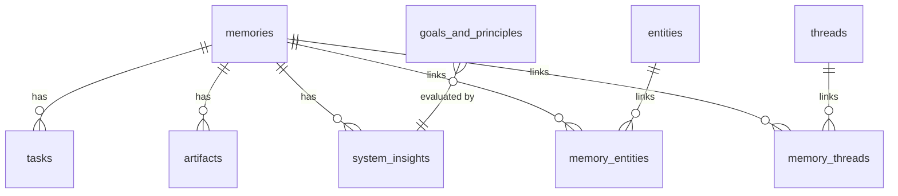

# Database Schema Reference

> **Parent Index:** [SKILL.md](./SKILL.md) — Read the root index first.

---

## Overview

The database is **Supabase PostgreSQL** with the `pgvector` extension for semantic search. The schema is managed via IaC (Supabase Migrations). All tables live in the `public` schema.

**Migrations applied:**
| File | Contents |
|------|----------|
| `001_expanded_schema.sql` | Core graph: `memories`, `tasks`, `entities`, `memory_entities`, `artifacts`, `goals_and_principles`, `system_insights`, `match_memories()` RPC |
| `002_threads.sql` | Thread grouping: `threads`, `memory_threads` |
| `003_delete_all_data.sql` | Data reset utility (`TRUNCATE ... CASCADE` on all tables) |
| `004_async_ingestion.sql` | Async ingestion: add `slack_metadata` to `memories`, `pg_net` webhook trigger for `process-memory` |
| `005_mcp_mutations.sql` | MCP mutations: add `status` to `goals_and_principles`, create `merge_entities()` RPC |
| `006_automated_synthesis.sql` | `synthesis_reports` table for weekly digests and pg_cron script definition |
| `007_artifact_processing_and_rls.sql` | Adds `embedding` to `artifacts`, `pg_net` process-artifact webhook, federated search for `match_memories`, and enables Global Row Level Security |

---

## Table Definitions

### Core Storage

#### `memories`
Central capture table. Every thought/observation enters here first.

| Column | Type | Notes |
|--------|------|-------|
| `id` | UUID (PK) | Auto-generated |
| `content` | TEXT NOT NULL | Raw text of the captured thought |
| `embedding` | vector(1536) | OpenAI text-embedding-3-small output (nullable initially for async processing) |
| `type` | TEXT | `observation`, `decision`, `idea`, `complaint`, `log` (default: `observation`) |
| `slack_metadata` | JSONB | Stores Slack `channel`, `ts`, and `files` for async Edge Function replies |
| `created_at` | TIMESTAMPTZ | UTC default |

#### `artifacts`
Multi-modal file attachments linked to a memory. Files are stored in Supabase Storage bucket `artifacts`.

| Column | Type | Notes |
|--------|------|-------|
| `id` | UUID (PK) | Auto-generated |
| `memory_id` | UUID (FK → memories) | CASCADE on delete |
| `url` | TEXT NOT NULL | Supabase Storage public URL |
| `mime_type` | TEXT | e.g., `image/png`, `application/pdf` |
| `text_content` | TEXT | Populated by OCR/transcription via `process-artifact` |
| `embedding` | vector(1536) | Populated by `process-artifact` based on `text_content` |
| `created_at` | TIMESTAMPTZ | UTC default |

---

### The Planner (Execution Layer)

#### `tasks`
Action items extracted by the LLM, linked to their source memory.

| Column | Type | Notes |
|--------|------|-------|
| `id` | UUID (PK) | Auto-generated |
| `memory_id` | UUID (FK → memories) | CASCADE on delete |
| `description` | TEXT NOT NULL | The action item text |
| `status` | TEXT | Default: `pending` |
| `due_date` | TIMESTAMPTZ | Inferred by LLM, nullable |
| `created_at` | TIMESTAMPTZ | UTC default |

---

### The Strategist (Cognitive Layer)

#### `entities`
Knowledge Graph nodes representing people, projects, and concepts.

| Column | Type | Notes |
|--------|------|-------|
| `id` | UUID (PK) | Auto-generated |
| `name` | TEXT NOT NULL | Exact proper noun |
| `type` | TEXT NOT NULL | `Person`, `Project`, `Concept` |
| `created_at` | TIMESTAMPTZ | UTC default |

**Constraint:** `UNIQUE(name, type)` — same name can exist as different types.

#### `memory_entities`
Join table: many-to-many link between memories and entities.

| Column | Type | Notes |
|--------|------|-------|
| `memory_id` | UUID (FK → memories) | CASCADE on delete |
| `entity_id` | UUID (FK → entities) | CASCADE on delete |

**PK:** `(memory_id, entity_id)`

#### `threads`
Active streams of work or life logistics.

| Column | Type | Notes |
|--------|------|-------|
| `id` | UUID (PK) | Auto-generated |
| `name` | TEXT NOT NULL UNIQUE | Thread name |
| `created_at` | TIMESTAMPTZ | UTC default |

#### `memory_threads`
Join table: many-to-many link between memories and threads.

| Column | Type | Notes |
|--------|------|-------|
| `memory_id` | UUID (FK → memories) | CASCADE on delete |
| `thread_id` | UUID (FK → threads) | CASCADE on delete |

**PK:** `(memory_id, thread_id)`

---

### The Mentor (Strategic Layer)

#### `goals_and_principles`
User-defined strategic goals and operational principles. Populated via `goal:` / `principle:` prefix in Slack.

| Column | Type | Notes |
|--------|------|-------|
| `id` | UUID (PK) | Auto-generated |
| `content` | TEXT NOT NULL | The goal or principle text |
| `type` | TEXT NOT NULL | `Goal` or `Principle` |
| `status` | TEXT | Default: `active`. Used for `archive_goal` MCP mutation. |
| `created_at` | TIMESTAMPTZ | UTC default |

#### `system_insights`
AI-generated evaluations of memories against goals. Created by `evaluateAgainstGoals()` during ingestion.

| Column | Type | Notes |
|--------|------|-------|
| `id` | UUID (PK) | Auto-generated |
| `memory_id` | UUID (FK → memories) | CASCADE on delete |
| `content` | TEXT NOT NULL | The strategic insight text |
| `created_at` | TIMESTAMPTZ | UTC default |

---

## RPC Functions

### `match_memories`

Semantic federated vector search over the `memories` and `artifacts` tables.

```sql
match_memories(
    query_embedding vector(1536),
    match_threshold float,
    match_count int,
    filter jsonb DEFAULT '{}'::jsonb
) RETURNS TABLE (id uuid, content text, type text, similarity float, created_at timestamptz)
```

**Algorithm:** Cosine distance (`<=>` operator) across both memories and artifacts. When an artifact matches, it returns its parent memory. The system groups by `memory_id` and takes the maximum similarity score among the base memory and all its attachments, ordered by similarity.

### `merge_entities`

Safely deduplicates the Knowledge Graph by merging a source entity into a target entity, securely handling `memory_entities` unique constraint conflicts, and deleting the source entity.

```sql
merge_entities(
    source_id uuid,
    target_id uuid
) RETURNS VOID
```

---

## Entity Relationship Diagram



---

## Security Architecture

| Layer | Mechanism |
|-------|-----------|
| **Slack → `ingest-thought`** | HMAC-SHA256 signature verification via `SLACK_SIGNING_SECRET` + 5-min replay protection |
| **AI Client → `open-brain-mcp`** | `MCP_ACCESS_KEY` via `x-brain-key` header or `?key=` query param |
| **Data API → PostgreSQL** | Global Row-Level Security (RLS) is ENFORCED on all tables. External REST/GraphQL queries are blocked. |
| **Supabase JWT** | Disabled (`--no-verify-jwt`) — application-level auth and secure `SUPABASE_SERVICE_ROLE_KEY` (for backend webhooks) used instead |

---

## Extensions

| Extension | Purpose |
|-----------|---------|
| `uuid-ossp` | UUID generation (`uuid_generate_v4()`) |
| `vector` (pgvector) | 1536-dim embedding storage and cosine similarity search |
| `pg_net` | Asynchronous HTTP requests for Database Webhooks (triggering Edge Functions) |
