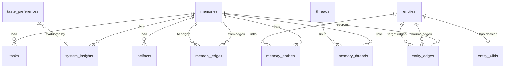

# Database Schema Reference

> **Parent Index:** [SKILL.md](./SKILL.md) — Read the root index first.

---

## Overview

The database is **Supabase PostgreSQL** with the `pgvector` extension for semantic search. The schema is managed via IaC (Supabase Migrations). All tables live in the `public` schema.

**Migrations applied:**
| File | Contents |
|------|----------|
| `001_expanded_schema.sql` | Core graph: `memories`, `tasks`, `entities`, `memory_entities`, `artifacts`, `system_insights`, `match_memories()` RPC |
| `002_threads.sql` | Thread grouping: `threads`, `memory_threads` |
| `003_delete_all_data.sql` | Data reset utility (`TRUNCATE ... CASCADE` on all tables) |
| `004_async_ingestion.sql` | Async ingestion: add `slack_metadata` to `memories`, `pg_net` webhook trigger for `process-memory` |
| `005_mcp_mutations.sql` | MCP mutations: create `merge_entities()` RPC |
| `006_automated_synthesis.sql` | `synthesis_reports` table for weekly digests and pg_cron script definition |
| `007_artifact_processing_and_rls.sql` | Adds `embedding` to `artifacts`, `pg_net` process-artifact webhook, federated search for `match_memories`, and enables Global Row Level Security |
| `008_harness_observability.sql` | Adds `processing_status`, `processing_error`, `cost_metrics` to `memories`, creates `mcp_operation_queue`. |
| `009_taste_preferences_migration.sql` | Creates `taste_preferences` table with want/reject constraints, drops `goals_and_principles`. |
| `010_content_hash_deduplication.sql` | Adds `content_hash` TEXT UNIQUE column to `memories` for strict SHA-256 deduplication. |
| `011_proactive_briefings_cron.sql` | Creates a pg_cron schedule to trigger the `proactive-briefings` Edge Function. |
| `012_wisdom_vertical_framework_and_learning.sql` | Creates `learning_topics`, `memory_learning_topics`, and `learning_milestones` tables for the Learning vertical. |
| `013_automated_synthesis_cron.sql` | Schedules the weekly synthesis report to run every Friday via pg_cron. |
| `014_system_config.sql` | `system_config` table for persistent configuration (replaces restricted GUCs). |
| `015_adaptive_capture_classification.sql` | Adds `capture_thresholds`, `classification_outcomes`, `correction_learnings`, and `ab_comparisons` tables for confidence-gated ingestion learning loop. |
| `016_work_operating_model.sql` | Adds `operating_model_profiles`, `operating_model_sessions`, `operating_model_layer_checkpoints`, `operating_model_entries`, and `operating_model_exports` tables, plus three RPCs for the BYOC workflow. |
| `017_formalized_workflow_statuses.sql` | Formalizes workflow statuses with CHECK constraint on `tasks` table (`pending`, `in_progress`, `blocked`, `deferred`, `completed`). |
| `018_repo_learning_coach.sql` | Creates 10 `repo_learning_*` tables for the Repo Learning Coach dashboard: `projects`, `research_documents`, `tracks`, `lessons`, `quizzes`, `quiz_questions`, `lesson_progress`, `quiz_attempts`, `quiz_responses`, `lesson_comments`. All tables have RLS enabled. |
| `019_obsidian_wiki_compiler.sql` | Creates `entity_wikis` table to cache generated markdown dossiers and sets up `obsidian-wiki-compiler-cron`. |
| `020_typed_edge_classifier.sql` | Creates `memory_edges` table with typed relation CHECK constraint and `memory_edges_upsert` RPC for idempotent edge insertion. Phase 21 (Reasoning Graph). |
| `021_enhanced_knowledge_graph.sql` | Creates `entity_edges` table for typed directed relationships between entities. Adds `entity_edges_upsert`, `traverse_entity_graph`, and `find_entity_path` RPCs. Phase 22 (Enhanced Knowledge Graph). |
| `022_thread_summarization.sql` | Extends `entity_wikis` and `memory_edges` to support thread summarization dossiers and `derived_from` provenance edges. Phase 23. |
| `023_retroactive_enrichment_sensitivity.sql` | Adds `sensitivity_tier` column to `memories` and `set_memory_sensitivity` RPC. Phase 24. |
| `024_fix_sensitivity_column.sql` | Ensures `sensitivity_tier` column is applied (Hotfix for sequential migration sync issue). Phase 24. |

---

## Table Definitions

### Core Storage

#### `memories`
Central capture table. Every thought/observation enters here first.

| Column | Type | Notes |
|--------|------|-------|
| `id` | UUID (PK) | Auto-generated |
| `content` | TEXT NOT NULL | Raw text of the captured thought |
| `content_hash` | TEXT UNIQUE | SHA-256 fingerprint of content to prevent duplicate ingestion |
| `embedding` | vector(1536) | OpenAI text-embedding-3-small output (nullable initially for async processing) |
| `type` | TEXT | `observation`, `decision`, `idea`, `complaint`, `log` (default: `observation`) |
| `sensitivity_tier` | TEXT | `standard`, `personal`, `restricted` (default: `standard`) |
| `slack_metadata` | JSONB | Stores Slack `channel`, `ts`, and `files` for async Edge Function replies |
| `processing_status` | processing_status (ENUM) | `pending`, `completed`, `failed` (default: `pending`) |
| `processing_error` | TEXT | Stores exception trace if extraction/ingestion fails |
| `cost_metrics` | JSONB | Stores OpenAI inference costs (`total_tokens`, etc.) |
| `created_at` | TIMESTAMPTZ | UTC default |

#### `artifacts`
Multi-modal file attachments linked to a memory. Files are stored in Supabase Storage bucket `artifacts`.

| Column | Type | Notes |
|--------|------|-------|
| `id` | UUID (PK) | Auto-generated |
| `memory_id` | UUID (FK → memories) | CASCADE on delete |
| `url` | TEXT NOT NULL | Supabase Storage public URL |
| `mime_type` | TEXT | e.g., `image/png`, `application/pdf` |
| `text_content` | TEXT | Populated by OCR/transcription via `process-artifact` |
| `embedding` | vector(1536) | Populated by `process-artifact` based on `text_content` |
| `created_at` | TIMESTAMPTZ | UTC default |

---

### The Planner (Execution Layer)

#### `tasks`
Action items extracted by the LLM, linked to their source memory.

| Column | Type | Notes |
|--------|------|-------|
| `id` | UUID (PK) | Auto-generated |
| `memory_id` | UUID (FK → memories) | CASCADE on delete |
| `description` | TEXT NOT NULL | The action item text |
| `status` | TEXT | Default: `pending`. Allowed: `pending`, `in_progress`, `blocked`, `deferred`, `completed` |
| `due_date` | TIMESTAMPTZ | Inferred by LLM, nullable |
| `created_at` | TIMESTAMPTZ | UTC default |

---

### The Strategist (Cognitive Layer)

#### `entities`
Knowledge Graph nodes representing people, projects, and concepts.

| Column | Type | Notes |
|--------|------|-------|
| `id` | UUID (PK) | Auto-generated |
| `name` | TEXT NOT NULL | Exact proper noun |
| `type` | TEXT NOT NULL | `Person`, `Project`, `Concept` |
| `created_at` | TIMESTAMPTZ | UTC default |

**Constraint:** `UNIQUE(name, type)` — same name can exist as different types.

#### `memory_entities`
Join table: many-to-many link between memories and entities.

| Column | Type | Notes |
|--------|------|-------|
| `memory_id` | UUID (FK → memories) | CASCADE on delete |
| `entity_id` | UUID (FK → entities) | CASCADE on delete |

**PK:** `(memory_id, entity_id)`

#### `entity_wikis`
Cache table for LLM-synthesized markdown dossiers of entities (or learning topics).

| Column | Type | Notes |
|--------|------|-------|
| `id` | UUID (PK) | Auto-generated |
| `reference_id` | UUID NOT NULL | FK to either `entities.id` or `learning_topics.id` |
| `reference_type` | TEXT NOT NULL | `'entity'` or `'learning_topic'` |
| `name` | TEXT NOT NULL | Slug or display name |
| `markdown_content` | TEXT NOT NULL | The LLM-generated dossier |
| `summary_memory_id` | UUID (FK → memories) | Link to the summary memory in core table (nullable) |
| `last_compiled_at` | TIMESTAMPTZ | UTC default |

#### `threads`
Active streams of work or life logistics.

| Column | Type | Notes |
|--------|------|-------|
| `id` | UUID (PK) | Auto-generated |
| `name` | TEXT NOT NULL UNIQUE | Thread name |
| `created_at` | TIMESTAMPTZ | UTC default |

#### `memory_threads`
Join table: many-to-many link between memories and threads.

| Column | Type | Notes |
|--------|------|-------|
| `memory_id` | UUID (FK → memories) | CASCADE on delete |
| `thread_id` | UUID (FK → threads) | CASCADE on delete |

**PK:** `(memory_id, thread_id)`

#### `memory_edges`
Typed logical reasoning edges between memories. Populated by the `classify-memory-edges` Edge Function and the `.agents/skills/typed-edge-classifier/classify.ts` local skill.

| Column | Type | Notes |
|--------|------|-------|
| `id` | UUID (PK) | Auto-generated |
| `from_memory_id` | UUID (FK → memories) | CASCADE on delete |
| `to_memory_id` | UUID (FK → memories) | CASCADE on delete |
| `relation` | TEXT NOT NULL | `supports`, `contradicts`, `evolved_into`, `supersedes`, `depends_on`, `related_to`, `derived_from` |
| `direction` | TEXT NOT NULL | `A_to_B`, `B_to_A`, or `symmetric` (default: `A_to_B`) |
| `confidence` | NUMERIC(4,2) | Score in [0.00 – 1.00] from LLM classifier |
| `support_count` | INT | Evidence accumulation: incremented on re-classification of the same pair |
| `classifier_version` | TEXT | Semver tag for the prompt/vocabulary used (e.g. `typed-edge-classifier-1.0.0`) |
| `valid_from` | DATE | Optional: relation start date (ISO YYYY-MM-DD) |
| `valid_until` | DATE | Optional: relation end date (ISO YYYY-MM-DD) |
| `metadata` | JSONB | `{ rationale, classifier_model, direction }` |
| `created_at` | TIMESTAMPTZ | UTC default |

**Constraints:** `UNIQUE(from_memory_id, to_memory_id, relation)` — same pair can have multiple relation types. No self-loops (`from_memory_id <> to_memory_id`).

---

#### `entity_edges`
Typed, directed, weighted relationships between entities. Populated automatically by the `extractMetadata` LLM prompt during ingestion and retroactively by the `.agents/skills/entity-relationship-backfill/classify.ts` script.

| Column | Type | Notes |
|--------|------|-------|
| `id` | UUID (PK) | Auto-generated |
| `source_entity_id` | UUID (FK → entities) | CASCADE on delete |
| `target_entity_id` | UUID (FK → entities) | CASCADE on delete |
| `relationship_type` | TEXT NOT NULL | `works_on`, `depends_on`, `uses`, `knows`, `manages`, `related_to` |
| `weight` | NUMERIC(4,2) DEFAULT 1.00 | Confidence/strength [0.00–1.00] |
| `properties` | JSONB DEFAULT '{}' | Flexible metadata: `{ rationale, source }` |
| `memory_id` | UUID (FK → memories) NULL | The memory that sourced this edge; SET NULL on delete |
| `created_at` | TIMESTAMPTZ | UTC default |

**Constraints:** `UNIQUE(source_entity_id, target_entity_id, relationship_type)` — same entity pair can have multiple distinct relationship types. No self-loops (`source_entity_id <> target_entity_id`).

---

### The Mentor (Strategic Layer)

#### `taste_preferences`
User-defined strict boundaries used as guardrails to evaluate thoughts against. Populated via `pref:`, `goal:`, or `principle:` prefixes in Slack.

| Column | Type | Notes |
|--------|------|-------|
| `id` | UUID (PK) | Auto-generated |
| `preference_name` | TEXT NOT NULL | Short title |
| `domain` | TEXT | E.g. general, family, work |
| `reject` | TEXT NOT NULL | Explicit conditions for what is discouraged or invalid |
| `want` | TEXT NOT NULL | Explicit conditions for what is desired or aligned |
| `constraint_type` | TEXT NOT NULL | Context classification (Goal, Principle, Style, etc.) |
| `status` | TEXT | Default: `active`. Used to soft-delete without losing historic context. |
| `created_at` | TIMESTAMPTZ | UTC default |

#### `system_insights`
AI-generated evaluations of memories against goals. Created by `evaluateAgainstGoals()` during ingestion.

| Column | Type | Notes |
|--------|------|-------|
| `id` | UUID (PK) | Auto-generated |
| `memory_id` | UUID (FK → memories) | CASCADE on delete |
| `content` | TEXT NOT NULL | The strategic insight text |
| `created_at` | TIMESTAMPTZ | UTC default |

#### `mcp_operation_queue`
Gated approval queue for highly privileged operations requested by AI agents.

| Column | Type | Notes |
|--------|------|-------|
| `id` | UUID (PK) | Auto-generated |
| `operation_type` | TEXT NOT NULL | Describes tool intended (`merge_entities`, `add_taste_preference`, etc) |
| `payload` | JSONB NOT NULL | Arguments provided by the AI client |
| `status` | TEXT NOT NULL | Default: `pending`. Can transition to `approved`, `rejected` |
| `created_at` | TIMESTAMPTZ | UTC default |
| `updated_at` | TIMESTAMPTZ | Last touch time |
| `cost_metrics` | JSONB | Stores usage in tokens and USD |

| `description` | TEXT | Contextual milestone description |
| `created_at` | TIMESTAMPTZ | UTC default |

---

### System Configuration

#### `system_config`
Internal key-value store for environment variables (e.g. `project_ref`, `service_role_key`) accessible by background jobs.

| Column | Type | Notes |
|--------|------|-------|
| `key` | TEXT (PK) | Configuration key |
| `value` | TEXT NOT NULL | Configuration value |
| `description`| TEXT | Documentation for the key |
| `updated_at` | TIMESTAMPTZ | Last change time |

**How to set values:**
```sql
INSERT INTO public.system_config (key, value) VALUES
('project_ref', 'your-ref'),
('service_role_key', 'your-key')
ON CONFLICT (key) DO UPDATE SET value = EXCLUDED.value;
```

---

### Extensions / Wisdom Verticals

#### `learning_topics`
Domain-specific extension mapping subjects/skills learned across the graph.

| Column | Type | Notes |
|--------|------|-------|
| `id` | UUID (PK) | Auto-generated |
| `topic_name` | TEXT NOT NULL UNIQUE | Name of the subject being studied |
| `mastery_status` | TEXT | `learning`, `exploring`, `mastered`, `struggling` |
| `created_at` | TIMESTAMPTZ | UTC default |

#### `memory_learning_topics`
Join table: many-to-many link between memories and learning topics.

| Column | Type | Notes |
|--------|------|-------|
| `memory_id` | UUID (FK → memories) | CASCADE on delete |
| `topic_id` | UUID (FK → learning_topics) | CASCADE on delete |

#### `learning_milestones`
Domain-specific achievements tied to learning topics and specific memories.

| Column | Type | Notes |
|--------|------|-------|
| `id` | UUID (PK) | Auto-generated |
| `topic_id` | UUID (FK → learning_topics) | CASCADE on delete |
| `memory_id` | UUID (FK → memories) | CASCADE on delete |
| `description` | TEXT NOT NULL | Contextual milestone description |
| `created_at` | TIMESTAMPTZ | UTC default |

---

## RPC Functions

### `match_memories`

Semantic federated vector search over the `memories` and `artifacts` tables.

```sql
match_memories(
    query_embedding vector(1536),
    match_threshold float,
    match_count int,
    filter jsonb DEFAULT '{}'::jsonb
) RETURNS TABLE (id uuid, content text, type text, similarity float, created_at timestamptz)
```

**Algorithm:** Cosine distance (`<=>` operator) across both memories and artifacts. When an artifact matches, it returns its parent memory. The system groups by `memory_id` and takes the maximum similarity score among the base memory and all its attachments, ordered by similarity.

### `memory_edges_upsert`

Idempotent upsert for typed reasoning edges. On conflict (same `from_memory_id`, `to_memory_id`, `relation` triplet) it bumps `support_count`, takes the max `confidence`, widens temporal bounds (LEAST `valid_from`, GREATEST `valid_until`), and refreshes `metadata`.

```sql
memory_edges_upsert(
    p_from_memory_id    UUID,
    p_to_memory_id      UUID,
    p_relation          TEXT,
    p_confidence        NUMERIC,
    p_support_count     INT     DEFAULT 1,
    p_classifier_version TEXT   DEFAULT 'typed-edge-classifier-1.0.0',
    p_valid_from        DATE    DEFAULT NULL,
    p_valid_until       DATE    DEFAULT NULL,
    p_metadata          JSONB   DEFAULT NULL
) RETURNS public.memory_edges
```

### `entity_edges_upsert`

Idempotent upsert for entity relationship edges. On conflict (same `source_entity_id`, `target_entity_id`, `relationship_type` triplet) it takes the MAX weight (never downgrades confidence) and merges incoming `properties` JSONB over existing.

```sql
entity_edges_upsert(
    p_source_entity_id  UUID,
    p_target_entity_id  UUID,
    p_relationship_type TEXT,
    p_weight            NUMERIC  DEFAULT 1.00,
    p_properties        JSONB    DEFAULT NULL,
    p_memory_id         UUID     DEFAULT NULL
) RETURNS public.entity_edges
```

### `traverse_entity_graph`

Recursive CTE multi-hop walk from a starting entity through `entity_edges`. Returns all reachable entities with depth, path (array of UUIDs), and the relationship type traversed at each hop. Supports optional `relationship_type` filter and configurable `max_depth`.

```sql
traverse_entity_graph(
    p_start_entity_id   UUID,
    p_max_depth         INT   DEFAULT 3,
    p_relationship_type TEXT  DEFAULT NULL
) RETURNS TABLE (entity_id UUID, entity_name TEXT, entity_type TEXT, depth INT, path UUID[], via_relationship TEXT)
```

### `find_entity_path`

BFS shortest path between two entities following edges in both directions. Returns each step with entity name and the relationship type traversed at that hop.

```sql
find_entity_path(
    p_start_entity_id   UUID,
    p_end_entity_id     UUID,
    p_max_depth         INT DEFAULT 6
) RETURNS TABLE (step INT, entity_id UUID, entity_name TEXT, via_relationship TEXT)
```

### `set_memory_sensitivity`

Updates the `sensitivity_tier` of a specific memory. Used by the retroactive backfill skill. `SECURITY DEFINER` (runs with service_role privileges).

```sql
set_memory_sensitivity(
    p_memory_id UUID,
    p_tier      TEXT
) RETURNS VOID
```

### `merge_entities`

Safely deduplicates the Knowledge Graph by merging a source entity into a target entity, securely handling `memory_entities` unique constraint conflicts, and deleting the source entity.

```sql
merge_entities(
    source_id uuid,
    target_id uuid
) RETURNS VOID
```

### `operating_model_next_layer`

Returns the next incomplete layer name (one of the five canonical layers) or `'review'` when all five are complete.

```sql
operating_model_next_layer(
    p_completed_layers TEXT[]
) RETURNS TEXT
```

### `operating_model_start_session`

Creates or resumes a BYOC profile and session for a given `user_id`. Returns full session state including completed layers, pending layer, and historical checkpoints.

```sql
operating_model_start_session(
    p_user_id UUID,
    p_session_name TEXT DEFAULT NULL
) RETURNS JSONB
```

### `operating_model_save_layer`

Saves an approved layer checkpoint and its structured entries. Advances the session state to the next pending layer.

```sql
operating_model_save_layer(
    p_session_id UUID,
    p_layer TEXT,
    p_checkpoint_summary TEXT,
    p_entries JSONB
) RETURNS JSONB
```

---

## Entity Relationship Diagram



---

## Security Architecture

| Layer | Mechanism |
|-------|-----------|
| **Slack → `ingest-thought`** | HMAC-SHA256 signature verification via `SLACK_SIGNING_SECRET` + 5-min replay protection |
| **AI Client → `open-brain-mcp`** | `MCP_ACCESS_KEY` via `x-brain-key` header or `?key=` query param |
| **Data API → PostgreSQL** | Global Row-Level Security (RLS) is ENFORCED on all tables. External REST/GraphQL queries are blocked. |
| **Supabase JWT** | Disabled (`--no-verify-jwt`) — application-level auth and secure `SUPABASE_SERVICE_ROLE_KEY` (for backend webhooks) used instead |

---

## Extensions

| Extension | Purpose |
|-----------|---------|
| `uuid-ossp` | UUID generation (`uuid_generate_v4()`) |
| `vector` (pgvector) | 1536-dim embedding storage and cosine similarity search |
| `pg_net` | Asynchronous HTTP requests for Database Webhooks (triggering Edge Functions) |
